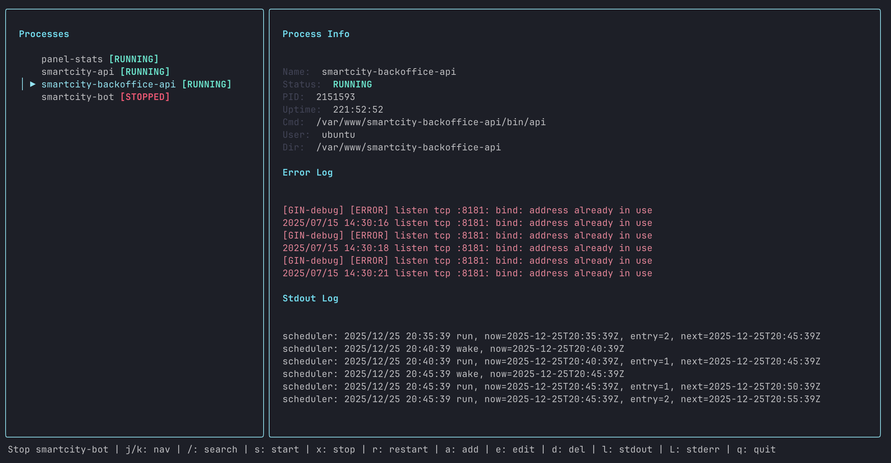

# Supervisord TUI

A vim-inspired terminal user interface (TUI) for managing supervisord processes. Easily browse, control, and manage your supervisord processes with a beautiful, keyboard-driven interface.



## Features

- **Three-panel interface**: Browse processes on the left, view details and logs on the right
- **Vim-like keybindings**: Navigate with `j`/`k`, search with `/`, and more
- **Process management**: Start, stop, restart processes with hotkeys
- **Full CRUD operations**: Add, edit, and delete supervisord process configurations
- **Live log viewing**: View last lines from stdout and stderr logs in real-time
- **Template-based creation**: Create new processes from a predefined template
- **Auto-refresh**: Process status and logs update automatically every 3 seconds
- **Config validation**: Helpful error messages with configuration guidance

## Installation

### Option 1: Homebrew (macOS/Linux) 🍺

```bash
brew install nicklasos/tap/god
```

### Option 2: Download Binary 📦

Download the latest binary for your platform from the [releases page](https://github.com/nicklasos/god/releases).

**macOS:**
```bash
# Intel Mac
curl -L https://github.com/nicklasos/god/releases/latest/download/god_Darwin_x86_64.tar.gz -o god.tar.gz
tar xzf god.tar.gz
sudo mv god /usr/local/bin/
rm god.tar.gz

# Apple Silicon (M1/M2/M3)
curl -L https://github.com/nicklasos/god/releases/latest/download/god_Darwin_arm64.tar.gz -o god.tar.gz
tar xzf god.tar.gz
sudo mv god /usr/local/bin/
rm god.tar.gz
```

**Linux:**
```bash
# AMD64
curl -L https://github.com/nicklasos/god/releases/latest/download/god_Linux_x86_64.tar.gz -o god.tar.gz
tar xzf god.tar.gz
sudo mv god /usr/local/bin/
rm god.tar.gz

# ARM64
curl -L https://github.com/nicklasos/god/releases/latest/download/god_Linux_arm64.tar.gz -o god.tar.gz
tar xzf god.tar.gz
sudo mv god /usr/local/bin/
rm god.tar.gz
```

**Windows:**
Download the `.zip` file from [releases](https://github.com/nicklasos/god/releases) and extract it to a directory in your PATH.

### Option 3: Install with Go

```bash
go install github.com/nicklasos/supervisord-tui@latest
```

Make sure `$GOPATH/bin` or `$GOBIN` is in your PATH.

### Option 4: Build from Source

```bash
git clone https://github.com/nicklasos/god.git
cd god
make build
sudo mv god /usr/local/bin/
```

## Requirements

- Go 1.21 or later
- supervisord installed and configured
- A terminal with support for ANSI colors

## Configuration

The application automatically detects your supervisord config file by checking:

1. `SUPERVISOR_CONFIG` environment variable
2. `/etc/supervisor/supervisord.conf` (Linux)
3. `/etc/supervisord.conf` (Linux)
4. `/opt/homebrew/etc/supervisord.conf` (macOS Apple Silicon)
5. `/usr/local/etc/supervisord.conf` (macOS Intel)
6. `~/.supervisord.conf` (user home)

You can also specify the config file path:

```bash
god -config /path/to/supervisord.conf
```

Or if installed via `go install`:

```bash
supervisord-tui -config /path/to/supervisord.conf
```

### Required Config Sections

Your supervisord config file must include these sections:

```ini
[unix_http_server]
file=/tmp/supervisor.sock
chmod=0700

[supervisord]
logfile=/tmp/supervisord.log
pidfile=/tmp/supervisord.pid

[rpcinterface:supervisor]
supervisor.rpcinterface_factory = supervisor.rpcinterface:make_main_rpcinterface

[supervisorctl]
serverurl=unix:///tmp/supervisor.sock
```

The application will show helpful error messages if these sections are missing.

## Usage

Simply run:

```bash
supervisord-tui
```

The application will:
1. Find and load your supervisord config file
2. Get the current status of all processes
3. Display them in the TUI interface

## Keybindings

### Normal Mode (List View)

- `j` / `↓` - Move down in the process list
- `k` / `↑` - Move up in the process list
- `/` - Enter search mode
- `s` - Start the selected process
- `x` - Stop the selected process
- `r` - Restart the selected process
- `a` - Add a new process (with template)
- `e` - Edit the selected process configuration
- `d` - Delete the selected process
- `l` - View stdout log in editor
- `L` - View stderr log in editor
- `q` / `Ctrl+C` - Quit the application

### Search Mode

- Type to filter the process list in real-time
- `Enter` - Exit search mode
- `Esc` - Cancel search and return to normal mode

### Edit Mode

- Edit the process configuration in a textarea
- `Enter` - Save changes
- `Esc` - Cancel editing and return to normal mode

### Delete Confirmation

- `y` - Confirm deletion
- `n` / `Esc` - Cancel deletion

## Process Configuration Format

Processes are configured using standard supervisord INI format:

```ini
[program:myapp]
command=/path/to/command
directory=/path/to/directory
user=username
autostart=true
autorestart=true
startsecs=10
startretries=3
stdout_logfile=/var/log/myapp.log
stderr_logfile=/var/log/myapp-error.log
stdout_logfile_maxbytes=1MB
stdout_logfile_backups=10
stderr_logfile_maxbytes=1MB
stderr_logfile_backups=10
environment=KEY1=value1,KEY2=value2
priority=999
stopsignal=TERM
stopwaitsecs=30
```

## Interface Layout

The interface is divided into two main areas:

1. **Left Panel**: Process list with status indicators
2. **Right Panel**: Combined panel with three sections:
   - **Process Info**: Process information (name, status, PID, uptime, config) - each parameter on its own line
   - **Error Log**: Last 6 lines from stderr
   - **Stdout Log**: Last 6 lines from stdout

## Status Indicators

Process status is color-coded:
- **Green** - RUNNING
- **Red** - STOPPED, FATAL
- **Yellow** - STARTING, STOPPING
- **Gray** - EXITED, UNKNOWN

## Viewing Logs

- Press `l` to open the stdout log file in your default editor (`$EDITOR` or `vi`)
- Press `L` (Shift+L) to open the stderr log file in your default editor
- The last 6 lines from each log are also displayed in the right panel

## Development

To build from source:

```bash
git clone https://github.com/nicklasos/god.git
cd god
make build
```

Or use the Makefile targets:

```bash
make help        # Show all available targets
make build       # Build the binary
make install     # Install to GOPATH/bin
make test        # Run tests
make release     # Create a release (requires GoReleaser and git tag)
make snapshot    # Create a snapshot build
```

## Creating Releases

Releases are automated using GitHub Actions. To create a new release:

1. Create and push a git tag:
   ```bash
   git tag -a v1.0.0 -m "Release v1.0.0"
   git push origin v1.0.0
   ```

2. GitHub Actions will automatically:
   - Build binaries for Linux (amd64, arm64), macOS (amd64, arm64), and Windows (amd64)
   - Create a GitHub release with all binaries
   - Update the Homebrew tap (if `HOMEBREW_TAP_TOKEN` secret is configured)

**Setting up GitHub Secrets:**

For automatic Homebrew tap updates, add a secret in your GitHub repository:
1. Go to Settings → Secrets and variables → Actions
2. Add a new secret named `HOMEBREW_TAP_TOKEN` with your GitHub token (needs `repo` scope)

**Local Release (Alternative):**

If you want to create a release locally:
```bash
make release
```

For snapshot builds (no git tag required):
```bash
make snapshot
```

### Dependencies

- `github.com/charmbracelet/bubbletea` - TUI framework
- `github.com/charmbracelet/lipgloss` - Styling
- `github.com/charmbracelet/bubbles` - UI components (textarea, textinput)

## Troubleshooting

### "supervisord config is missing [supervisorctl] section"

Add the required sections to your supervisord config file. See the Configuration section above.

### "supervisord is not running or socket not found"

Make sure supervisord is running:
```bash
supervisord -c /path/to/supervisord.conf
```

### Config file not found

Specify the config file path explicitly:
```bash
god -config /path/to/supervisord.conf
```

Or set the environment variable:
```bash
export SUPERVISOR_CONFIG=/path/to/supervisord.conf
god
```

## License

MIT

